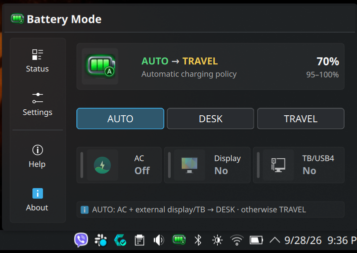
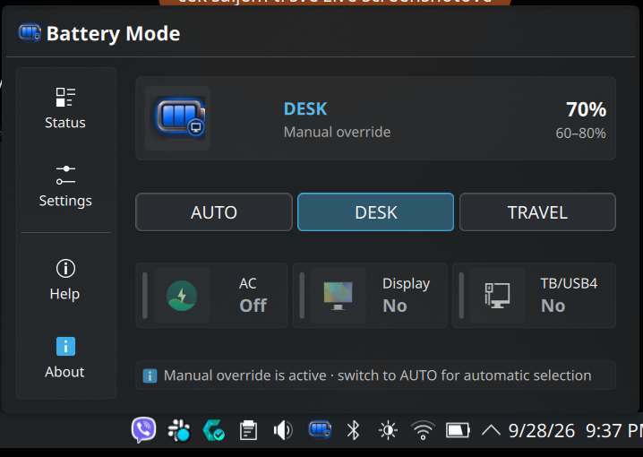
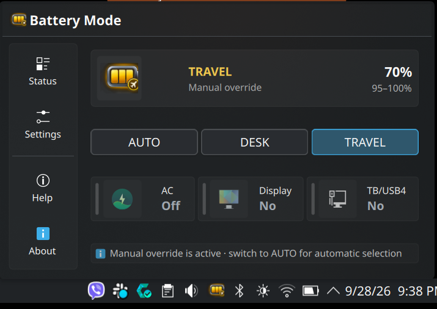
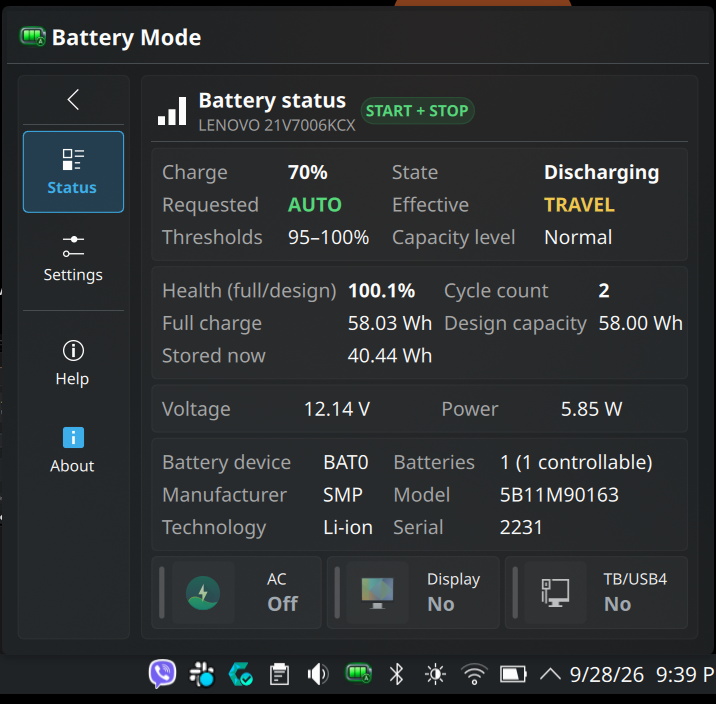
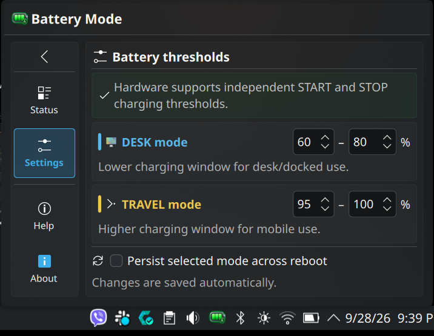
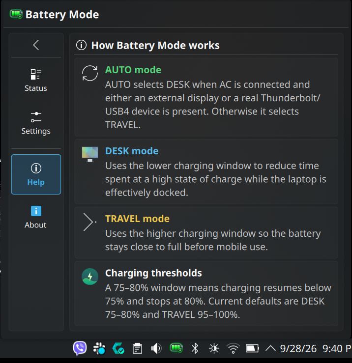
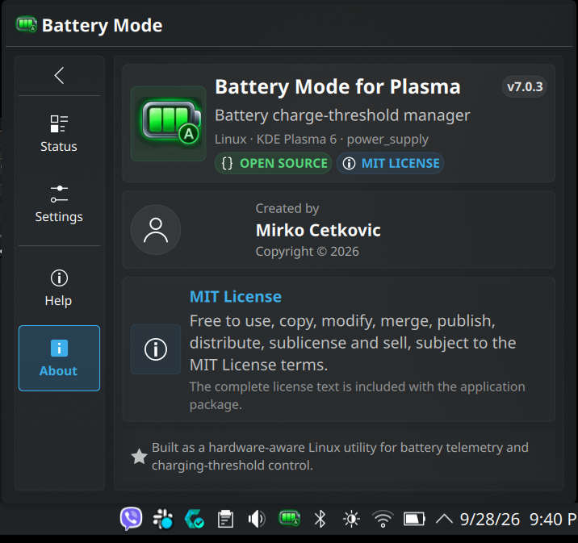

# Battery Mode for Plasma v7.0.5

<p align="center">
  <strong>Hardware-aware battery telemetry and charging-threshold profiles for KDE Plasma 6 on Linux.</strong>
</p>

<p align="center">
  
  
  
  
  
  
</p>

<p align="center">
  <em>Automatic DESK/TRAVEL charging profiles, rich battery telemetry, multi-battery support and a native Plasma System Tray UI.</em>
</p>

**Author:** Mirko Cetkovic  
**License:** MIT

## Features

- **AUTO / DESK / TRAVEL profiles** — automatic policy selection or manual override.
- **Hardware capability detection** — full START+STOP, STOP-only and status-only systems.
- **Rich battery telemetry** — cycle count, full/design capacity, health, voltage, current, power, temperature, time estimates and identity data when exposed by the kernel.
- **Multi-battery aware** — detects all Linux `power_supply` batteries and applies profiles to every controllable battery.
- **External-display + Thunderbolt/USB4 awareness** — AUTO can recognize docked/desktop use without vendor-specific assumptions.
- **Native KDE Plasma 6 UI** — compact System Tray popup with Overview, Status, Settings, Help and About pages.
- **Persistent settings** — threshold values and optional selected-mode persistence survive upgrades and reboots.
- **CLI included** — `battery-mode`, `battery-info`, `battery-auto-status`, `battery-settings` and profile commands.
- **No TLP required** — the root daemon writes only the kernel battery-threshold controls it detects.
- **Open source** — released under the MIT License.

## Quick start

```bash
tar xzf battery-mode-plasma-v7.0.5.tar.gz
cd battery-mode-plasma-v7.0.5
./install.sh
```

Run the installer as your normal desktop user. It performs hardware capability detection before replacing an existing installation and preserves existing settings during a normal upgrade.

## What changed in v7

v7 turns the original X1 Battery Mode project into a generic Linux
`power_supply` application.

The visible product name is now **Battery Mode**. The Plasma plugin ID,
systemd unit name and `/var/lib/x1-battery-auto` state directory are retained
internally for seamless upgrades from v6.

## Hardware support

The installer probes `/sys/class/power_supply` rather than checking for a
specific vendor or model.

Three support levels are recognized:

- **Full** — START + STOP threshold control.
- **Partial** — STOP-only threshold control; battery firmware decides when
  charging restarts.
- **Status-only** — no writable threshold interface, but battery telemetry is
  still available.

Battery Mode understands the standard Linux files:

```text
charge_control_start_threshold
charge_control_end_threshold
```

and also accepts the common legacy aliases:

```text
charge_start_threshold
charge_stop_threshold
```

The daemon applies a selected profile to every battery that exposes a supported
threshold interface.

## Battery telemetry

The Status page displays fields only when the kernel/driver actually exposes
them. Depending on hardware this can include:

- current charge percentage and state
- capacity level
- cycle count
- full charge capacity
- design capacity
- calculated full/design health percentage
- currently stored energy/charge
- voltage
- current
- power
- temperature
- time to empty / time to full
- manufacturer
- model
- serial number
- chemistry / technology
- kernel-reported battery health
- manufacture date
- battery device name
- number of detected / controllable batteries
- current charging thresholds
- AC, external-display and Thunderbolt/USB4 state

Energy and charge are kept separate: `ENERGY_*` values are shown in Wh and
`CHARGE_*` values in Ah.

If the driver does not expose `power_now` but exposes both `voltage_now` and
`current_now`, Battery Mode calculates the instantaneous electrical power and
marks it with `*`.

## Modes

### AUTO

When AC is online and either an external display or a real external
Thunderbolt/USB4 router is connected, AUTO selects the DESK profile.
Otherwise it selects TRAVEL.

### DESK

Default profile:

```text
75 / 80
```

### TRAVEL

Default profile:

```text
95 / 100
```

On STOP-only hardware, only the profile's stop value is shown/editable in the UI and only that value is written. The stored START value is kept internally valid for portability but is ignored by the hardware.

On status-only hardware, AUTO/DESK/TRAVEL controls are disabled in the Plasma
UI and the project functions as a battery monitor.

## Settings

Thresholds and requested-mode persistence are stored in:

```text
/var/lib/x1-battery-auto/settings.json
/var/lib/x1-battery-auto/mode
```

The legacy directory name is intentionally retained for upgrade compatibility.

An ordinary upgrade preserves settings. To reset to defaults:

```bash
./install.sh --reset-settings
```

## Installation

Run as your normal desktop user:

```bash
tar xzf battery-mode-plasma-v7.0.5.tar.gz
cd battery-mode-plasma-v7.0.5
./install.sh
```

The installer prints a capability report before changing the installed version.

## CLI

Compact mode:

```bash
battery-mode
```

Full telemetry:

```bash
battery-info --json
```

Hardware capability report:

```bash
battery-info --capabilities
```

Human-readable detailed status:

```bash
battery-auto-status
```

Mode control:

```bash
battery-auto
battery-desk
battery-travel
```

Settings:

```bash
battery-settings
battery-settings --json
```

## Logs

The legacy service name is retained for upgrade compatibility:

```bash
systemctl status x1-battery-auto.service
journalctl -u x1-battery-auto.service -n 50 --no-pager
journalctl -fu x1-battery-auto.service
```

## Uninstall

```bash
./uninstall.sh
```

## License

MIT License. See `LICENSE`.

## Screenshots

### Overview

<p align="center">
  
  
  
</p>

<p align="center">
  <em>AUTO, DESK and TRAVEL overview states.</em>
</p>

### Detail pages

<p align="center">
  
  
</p>

<p align="center">
  
  
</p>

<p align="center">
  <em>Status, Settings, Help and About pages.</em>
</p>


## v7.0.5: README screenshot gallery

This release adds a proper screenshot gallery to the project documentation.

The package now includes a `docs/screenshots/` directory with final captures of:

- Overview in **AUTO** mode
- Overview in **DESK** mode
- Overview in **TRAVEL** mode
- **Status** page
- **Settings** page
- **Help** page
- **About** page

The README uses GitHub-friendly centered image rows so the project page shows
a polished visual tour of the UI immediately.


## Earlier v7 UI refinements

### Status navigation polish

Status is now a first-class navigation action instead of being tucked away in
the bottom hint row.

The popup header now shows:

```text
Status · Settings · Help · About
```

The detailed-view navigation rail is grouped as:

```text
Status
Settings
────────
Help
About
```

The old bottom "Detailed status" button was removed to avoid duplicate entry
points and to keep the overview footer visually clean.

No battery logic, telemetry, hardware detection, thresholds or persistence
behavior changed.


### Persistent navigation rail

The navigation rail is now present on the overview as well as every detailed
page. Navigation has one consistent home:

```text
Status
Settings
────────
Help
About
```

When a detailed page is open, a back-to-overview button appears above the rail.
On the overview it is hidden.

The header is now intentionally simple: application icon + `Battery Mode`.
The duplicate Status/Settings/Help/About header buttons were removed, as were
the duplicate Settings/Help buttons inside the overview summary card.

Overview and detailed AC / Display / TB/USB4 status chips now share the same
larger minimum width so `TB/USB4` stays comfortably inside its card.

No battery logic, telemetry, thresholds, persistence, hardware detection or
popup anchoring behavior changed.

### Balanced overview spacing

The overview now uses the full height already required by the persistent
navigation rail. Instead of leaving that surplus as a single empty area below
the content, three equal elastic spacers distribute it between the summary,
mode controls, hardware-status chips and policy hint.

The popup height itself is unchanged. No battery logic, telemetry, thresholds,
hardware detection or persistence behavior changed.


## v7.0.5: GitHub-ready project page

This documentation-only release polishes the repository front page with:

- project badges
- a concise feature overview
- Quick Start instructions
- the complete screenshot gallery
- repository description, tagline and topic suggestions in `docs/GITHUB_REPO.md`

No battery logic, telemetry, threshold behavior, persistence or Plasma runtime behavior changed.
